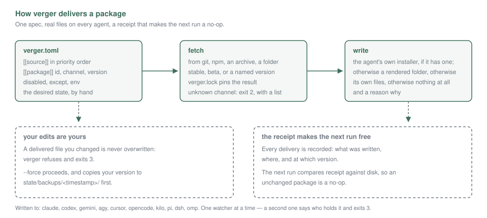

# verger, for humans

How a package gets from a spec line to real files on ten agents, and what happens when you touch
one of those files yourself.



## The spec is the desired state

One file, `verger.toml`, says what should be on the machine. It is hand-written, it travels with
the project, and verger never edits it behind your back.

```toml
[[source]]
name = "claude-plugins-official"
url  = "anthropics/claude-plugins-official"

[[package]]
id      = "JuliusBrussee/caveman"
channel = "stable"
except  = ["pi"]

[[package]]
id     = "acme/review-kit"
version = "2.3.1"      # a pin: "newest" never goes above this
```

Sources are tried in the order you list them, so a ref resolves against the first source that
offers it. That ordering is the whole priority mechanism — there is no separate rule.

`channel` asks for a line of releases rather than a version: `stable` takes the highest release,
`beta` takes the highest prerelease of the next line. A channel that does not exist is refused with
the list of the ones the source does offer, because "no such channel" on its own is a question you
can only answer by guessing. A channel that resolves to something older than what you have is
skipped unless you pass `--allow-downgrade`.

`except` is a host list to skip, `disabled` turns a package off without deleting it, and `env` sets
the variables a package expects. These are the same knobs whether you set them by hand or with
`verger enable`, `verger disable` and `verger pin`, which is the point: the CLI edits the spec, so
there is one place to read what the machine should look like.

## Resolve: from a name to something fetchable

A ref names a package; resolution turns it into a concrete thing on disk.

- **git** — a tag, a branch or a commit, from a URL or a `owner/name` shorthand
- **npm** — `name@version`, or a dist-tag when a channel is given
- **archive** — a URL plus a sha256, so what arrives is what was promised
- **local** — a directory next to the spec

The result is written to `verger.lock` with the exact revision. That lock is what makes a run
reproducible: the channel is consulted when the lock is made, and the pin is what is read back
afterwards. Re-running with an unchanged spec does not go back to the network.

## Deliver: per host, in the order the host prefers

Each host gets the package the way it accepts one, and the ladder is the same everywhere.

1. **native** — the host's own CLI or plugin registry takes it
2. **synth** — the payload is rendered into a directory the host reads
3. **loose** — files are written directly into the host's own layout
4. **silenced** — the host has no surface for this package at all, and the run says why

The rung chosen is recorded per cell, so `verger why <id>` answers "why did this one go loose?"
without guessing. Skipped rungs carry their reason too, which is usually the useful half.

Whatever the rung, what lands is **real files**. No symlinks into a store, no indirection to lose
the meaning of later. `verger status` shows the matrix of package × host; `--outdated-only` narrows
it to the cells that are behind.

## Your edits are yours

This is the rule worth internalising. If verger delivered a file and you then changed it, verger
will not overwrite it. The run stops and exits 3, naming the file.

```
$ verger sync
conflict: .claude/skills/caveman/SKILL.md was edited since it was delivered
          run `verger sync --force` to overwrite it, keeping your version
```

`--force` is the only way past it, and it is not the end of the story: your version is copied to
`state/backups/<timestamp>/` and the path is printed, so the overwrite is recoverable rather than
destructive. `-y` does not imply `--force` — answering a prompt is not consent to discard work.

## The receipt is why the next run is cheap

Every delivery records what was written, where, and at which version. The next run compares the
receipt against the disk:

- the package is on disk and the receipt matches — nothing happens
- the files are gone — it is an install, not a no-op
- the files are there but the receipt's digest does not match — a file moved, and that is your
  edit, so the hands-off guard is what refuses it

A package with no receipt on this machine is a **restore**: verger is writing what the lock says,
not what a run here did. `verger status` marks those, because a cloned machine inherits receipts
without the files they describe.

`verger remove` is a tombstone plus an RMA, not an `rm -rf`. The package is removed from every
host and kept in the trash for the retention window, where `verger restore` can bring it back and
`verger gc` eventually purges it.

## Watch, and the one lease

`verger watch` reconciles the scope whenever a host's files change. It is the cheap way to notice
that a host rewrote something of yours.

There is one lease, and beadle's watcher takes the same one. A second watcher does not compete and
does not queue: it says which watcher holds the lease and by which pid, and exits 3. Run whichever
you prefer, not both — and `verger service install` puts the loop in the background if you would
rather not keep a terminal open.

`--debounce` sets how long a host's changes are collected before a run, and `--owner` is the name
that shows up in the lease, so two hosts on two machines are distinguishable at a glance.

## Secrets

Values never reach a file you can read and never appear in output. `verger secret set <name>` reads
a value from stdin, so it is not in your shell history either.

The backend is `auto`, `keyring` or `file`. With `auto` and no keychain, verger uses `file` and
says so; asking for `keyring` when there is none exits 6. verger does not open a keychain to find
out whether it has one — that prompt is yours to answer, and a tool that triggers it behind your
back is a tool that can lock you out of your own machine.

The spec refers to a secret by name, and `env = { TOKEN = "{secret:TOKEN}" }` is how a package
receives it. `verger secret list` shows names, never values.

## Where to go next

- **[for AI agents](ai-agents.md)** — what an agent may rely on, and what it must not assume.
- `verger doctor` — the fastest way to find out what is wrong on a machine.
